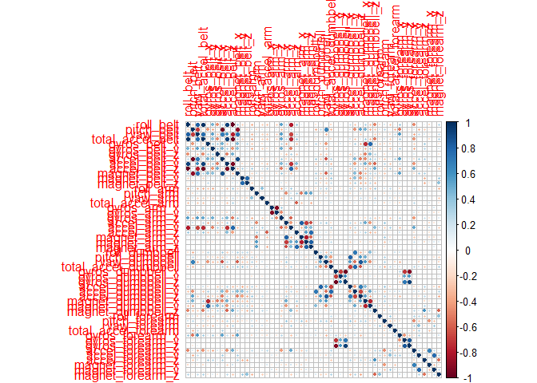
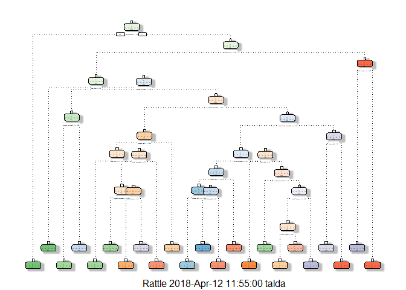

Background
==========

Using devices such as Jawbone Up, Nike FuelBand, and Fitbit it is now possible to collect a large amount of data about personal activity relatively inexpensively. These type of devices are part of the quantified self movement - a group of enthusiasts who take measurements about themselves regularly to improve their health, to find patterns in their behavior, or because they are tech geeks. One thing that people regularly do is quantify how much of a particular activity they do, but they rarely quantify how well they do it. In this project, your goal will be to use data from accelerometers on the belt, forearm, arm, and dumbell of 6 participants. They were asked to perform barbell lifts correctly and incorrectly in 5 different ways. More information is available from the website here: <http://groupware.les.inf.puc-rio.br/har> (see the section on the Weight Lifting Exercise Dataset).

Summary
=======

The goal of this project is to predict the manner in which they did the exercise. This is the "classe" variable in the training set. You may use any of the other variables to predict with. You should create a report describing how you built your model, how you used cross validation, what you think the expected out of sample error is, and why you made the choices you did. You will also use your prediction model to predict 20 different test cases.

Preprocessing
-------------

``` r
library(caret)
```

    ## Warning: package 'caret' was built under R version 3.4.3

    ## Loading required package: lattice

    ## Loading required package: ggplot2

    ## Warning: package 'ggplot2' was built under R version 3.4.3

``` r
library(corrplot)
```

    ## Warning: package 'corrplot' was built under R version 3.4.3

    ## corrplot 0.84 loaded

``` r
library(rattle)
```

    ## Warning: package 'rattle' was built under R version 3.4.4

    ## Rattle: A free graphical interface for data science with R.
    ## Version 5.1.0 Copyright (c) 2006-2017 Togaware Pty Ltd.
    ## Type 'rattle()' to shake, rattle, and roll your data.

``` r
library(rpart)
library(randomForest)
```

    ## Warning: package 'randomForest' was built under R version 3.4.3

    ## randomForest 4.6-12

    ## Type rfNews() to see new features/changes/bug fixes.

    ## 
    ## Attaching package: 'randomForest'

    ## The following object is masked from 'package:rattle':
    ## 
    ##     importance

    ## The following object is masked from 'package:ggplot2':
    ## 
    ##     margin

``` r
set.seed(123)

setwd("C:/users/talda/Desktop/Coursera/Course 8 Project")
train <- read.csv("pml-training.csv")
test <- read.csv("pml-testing.csv")
```

Cleaning the data
-----------------

First i'll omit the first six variables which don't contribute anything to the prediction process (ie. id, timestamp, etc.)

``` r
train <- train[, -c(1:7)]
```

Remove predictors that have one unique value (i.e. are zero variance predictors) or predictors that are have both of the following characteristics: they have very few unique values relative to the number of samples and the ratio of the frequency of the most common value to the frequency of the second most common value is large.

``` r
zeroVar <- nearZeroVar(train, saveMetrics = TRUE)
train <- train[, !zeroVar$nzv]
```

Omit variables with more than 75% NA's which in my opinion are redundant

``` r
train <- train[, -which(colMeans(is.na(train)) > 0.75)]
dim(train)
```

    ## [1] 19622    53

Corrolation plot:

``` r
corMatrix <- cor(train[,-53])
corrplot(corMatrix)
```



Removing highly correlated predictors:

``` r
train <- train[, -c(sort(findCorrelation(cor(train[,-53]), cutoff=0.9)))]
```

Cross-Validation
================

The train dataset has 46 variables and 19622 obs The test dataset has 46 variables and 20 obs the training data will be partitioned into 70% (cvTraining) and 30% (cvTesting) using random subsampling without replacement.

``` r
inTrain <- createDataPartition(y=train$classe, p=0.7, list=FALSE)
cvTraining <- train[inTrain, ] 
cvTesting <- train[-inTrain, ]
```

Model Creation
==============

in order to build the model and find the most suitable one i'll first try to use the decision tree model using the rpart library with method equal to class. after that i will try random forest using the randomForest library and i expect it to overcome the decision tree in the overall accuracy.

Desicion Tree
-------------

``` r
dt <- rpart(classe ~ ., data=cvTraining, method="class")
dtPrediction <- predict(dt, newdata = cvTesting, type = "class")
fancyRpartPlot(dt)
```

    ## Warning: labs do not fit even at cex 0.15, there may be some overplotting



Decision tree prediction results:

``` r
cm <- confusionMatrix(dtPrediction, cvTesting$classe)
cm
```

    ## Confusion Matrix and Statistics
    ## 
    ##           Reference
    ## Prediction    A    B    C    D    E
    ##          A 1387  184   19   28  133
    ##          B   18  546   46   90   49
    ##          C   79  191  853  155   71
    ##          D  178  138   59  643   98
    ##          E   12   80   49   48  731
    ## 
    ## Overall Statistics
    ##                                           
    ##                Accuracy : 0.7069          
    ##                  95% CI : (0.6951, 0.7185)
    ##     No Information Rate : 0.2845          
    ##     P-Value [Acc > NIR] : < 2.2e-16       
    ##                                           
    ##                   Kappa : 0.6294          
    ##  Mcnemar's Test P-Value : < 2.2e-16       
    ## 
    ## Statistics by Class:
    ## 
    ##                      Class: A Class: B Class: C Class: D Class: E
    ## Sensitivity            0.8286  0.47937   0.8314   0.6670   0.6756
    ## Specificity            0.9136  0.95723   0.8979   0.9039   0.9606
    ## Pos Pred Value         0.7921  0.72897   0.6323   0.5762   0.7946
    ## Neg Pred Value         0.9306  0.88454   0.9619   0.9327   0.9293
    ## Prevalence             0.2845  0.19354   0.1743   0.1638   0.1839
    ## Detection Rate         0.2357  0.09278   0.1449   0.1093   0.1242
    ## Detection Prevalence   0.2975  0.12727   0.2292   0.1896   0.1563
    ## Balanced Accuracy      0.8711  0.71830   0.8647   0.7854   0.8181

so the accuracy is:

``` r
cm$overall[1]
```

    ##  Accuracy 
    ## 0.7068819

Random Forest
-------------

``` r
rforest <- randomForest(classe~., data=cvTraining)
rfPrediction <- predict(rforest, newdata = cvTesting)
```

Random forest prediction results:

``` r
cm <- confusionMatrix(rfPrediction, cvTesting$classe)
cm
```

    ## Confusion Matrix and Statistics
    ## 
    ##           Reference
    ## Prediction    A    B    C    D    E
    ##          A 1673    6    0    0    0
    ##          B    1 1132   14    0    0
    ##          C    0    1 1012   14    0
    ##          D    0    0    0  949    0
    ##          E    0    0    0    1 1082
    ## 
    ## Overall Statistics
    ##                                           
    ##                Accuracy : 0.9937          
    ##                  95% CI : (0.9913, 0.9956)
    ##     No Information Rate : 0.2845          
    ##     P-Value [Acc > NIR] : < 2.2e-16       
    ##                                           
    ##                   Kappa : 0.992           
    ##  Mcnemar's Test P-Value : NA              
    ## 
    ## Statistics by Class:
    ## 
    ##                      Class: A Class: B Class: C Class: D Class: E
    ## Sensitivity            0.9994   0.9939   0.9864   0.9844   1.0000
    ## Specificity            0.9986   0.9968   0.9969   1.0000   0.9998
    ## Pos Pred Value         0.9964   0.9869   0.9854   1.0000   0.9991
    ## Neg Pred Value         0.9998   0.9985   0.9971   0.9970   1.0000
    ## Prevalence             0.2845   0.1935   0.1743   0.1638   0.1839
    ## Detection Rate         0.2843   0.1924   0.1720   0.1613   0.1839
    ## Detection Prevalence   0.2853   0.1949   0.1745   0.1613   0.1840
    ## Balanced Accuracy      0.9990   0.9953   0.9916   0.9922   0.9999

so the accuracy is:

``` r
cm$overall[1]
```

    ##  Accuracy 
    ## 0.9937128

Decision and out of sample error
================================

i decided to choose the random forest model, as expected it has extremely high accuracy (0.9942) and i expect it to predict the test set very well, thus it willl provide the predictions for the submission. because we used a validation set we can expect the out of sample error to be about 0.0058.

Submission - predicting of the test set
=======================================

``` r
testPred <- predict(rforest, newdata = test, type = "class")
testPred
```

    ##  1  2  3  4  5  6  7  8  9 10 11 12 13 14 15 16 17 18 19 20 
    ##  B  A  B  A  A  E  D  B  A  A  B  C  B  A  E  E  A  B  B  B 
    ## Levels: A B C D E
